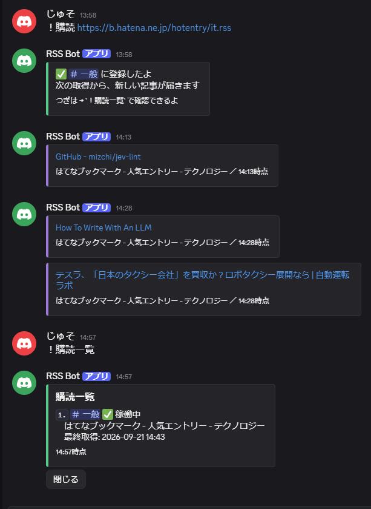

# 作ったもの ── Discord bot 2つ

Discord の bot を作っています。片方は 2026年から自分で動かしているもの、
もう片方は**受注を想定して1から作った1件**です。

**どちらもソースは公開していません**（設計書・DB・ログが入っているため）。
ここにあるのは、何が作れるかと、どう作っているかの記録です。

---

## 1. RSS通知bot ── 受注を想定して作った1件

登録した RSS / Atom フィードを15分おきに見に行き、**新しい記事だけ**を
Discord のチャンネルへ流す bot です。

上の画面で起きていること ──

- `！購読 <URL>` で登録すると、どのチャンネルに入れたかを返す
- **登録した直後は過去記事を流さない。** 最初の取得は「どこまで出ているか」を覚えるだけ
- 15分おきに見に行き、**前回から増えたぶんだけ**を投稿する（14:13 に1件、14:28 に2件）
- `！購読一覧` で、状態（✅ 稼働中）と**最終取得の時刻**が見られる
  ── 14:43 に取りに行って新しい記事が無かったので何も投稿していない。
  **「黙っている」と「止まっている」が見分けられる**

他にできること ──

- 1回の取得で流すのは最大3件。古いものから
- 取得に10回続けて失敗したら止めて、**止めたことを知らせる**（黙って止まらない）
- 登録の時点で bot がそのチャンネルに書けるかを見て、**書けないなら登録を断る**
  ── 「登録できたのに永久に届かない」を作らないため

### 依頼者が自分で起動できるかを、実機で測りました

まっさらな `git clone` から、**README だけを見て 19分34秒**で
起動・登録・投稿まで通りました（2026-09-20、Windows 11）。

| 工程 | 時間 |
|---|---|
| Discord 側の準備（Developer Portal） | 12分12秒 |
| 設定ファイルを作る | 2分6秒 |
| 起動する | 5分16秒 |

**「動くはずです」ではなく、時計で測った数字です。**
このとき README の表記が実機と合っていない箇所が1つ見つかり、直してあります。

### 品質の担保

| 項目 | 内容 |
|---|---|
| 設計書 | `docs/DESIGN.md` 769行（8章＋付録4）。**コードより先に設計書を直す**運用 |
| 自動テスト | pytest **299件**（本番コード 3,037行、テスト17ファイル） |
| 型検査 | pyright strict **0 errors** |
| 変異試験 | コミットごとに、承認した仕組みへ変異を当てる。**赤にならないテストのほうを疑う** |
| 外部URLの扱い | 内部アドレスへの接続を拒否。**検査したIPに直接繋ぐ**（検査の後に名前解決をすり替えられる穴を塞ぐ） |
| ログ | URLの生値・利用者IDの生値を書かない。利用者IDはマスク。監査ログは90日保持 |
| コミット | 25回。**1件ずつ目視で承認**してから記録 |

---

## 2. ふんふんbot ── プロセカのイベント順位予測

音楽ゲーム「プロジェクトセカイ」のイベントで、自分の順位に必要なペースを計算する bot です。
2026年から動かしています。

### できること

- **自分の pt を送るだけで時速が出る** ── 記録して、少し時間をあけてもう一度送ると時速を計算
- **全体の状況をひと目で** ── 残り時間・自分の pt・時速・ボーダー予測を1枚のカードに
- **順位に必要なペース** ── その順位に要る時速と、いまのペースで届くかどうか
- **最終ボーダーの予測** ── 代表的な順位、または指定した順位の最終ボーダーをレンジで
- **リフレッシュゲージ** ── 100% までの曲数と休憩の目安
- **オフライン中の見通し** ── 戻ったあとに必要なペースを先に出す
- **通知** ── 目標到達、イベント終了サマリー、定期配信
- **グラフ** ── 自分の pt 推移を画像で
- **ワールドリンク（チャプター制イベント）対応** ── 章ごとに区間を切って計算

外部サイトからボーダーを20分おきに自動取得し、SQLite に保存して予測に使います。

### 設計で決めていること

- **煽らない・宥めない** ── 「まだいける」も「無理しないで」も言わない。事実だけを中立に出す
- **入口3系統・処理1つ** ── `！`・メンション・`/` のどれから来ても同じ関数
- **色だけで伝えない** ── 状態は色・絵文字・言葉の3点セット
- **Embed はヘルパー経由でしか作れない** ── 上限やフッターの鮮度表示を、呼び出し側が違反できない形で強制
- **秘密は型で封じる** ── トークンは `SecretStr`。表示経路のどこにも出ないことをテストで固定
- **予測が信用できないときは、予測を出さない** ── 均せていないうちはレンジも出さない

### 品質の担保

| 項目 | 内容 |
|---|---|
| 設計書 | `docs/DESIGN.md` 3,389行 |
| セキュリティ設計 | `docs/SECURITY.md` 571行（脅威モデル、Discord 固有の脆弱性、秘密情報のライフサイクル、インシデント対応） |
| 自動テスト | pytest 813件 |
| 型検査 | pyright strict。**残り7件。減らしている途中** |
| 監査ログ | 状態を変える操作だけを90日保持。利用者IDはマスク |

**動かしている場所は自分の PC です。** 常時稼働のサーバーには置いていないので、
PC を落とせば止まります。

---

## 作り方

設計（Claude / Cowork）→ 実装（Claude Code）→ **承認（人）** の三人体制です。

- 差分は**1件ずつ目視で承認**してから記録する。まとめて承認はしない
- 承認するときは「**それを守るテストはどれか**」を一緒に決める。承認だけでは何も守られない
- 承認した仕組みには**変異を当てる**。赤にならないものがあれば、疑うのは変異ではなくテストのほう
- `rm` / `git push` / `reset --hard` はフックで機械的に止める。コミットの前に必ず精査を挟む

## 技術

Python 3.12+ / discord.py / aiosqlite / pydantic / feedparser / aiohttp / matplotlib / pytest / pyright

---

## ご依頼

Discord bot の制作を承っています。ご相談・お見積りはココナラからどうぞ。

**https://coconala.com/services/4399424**
